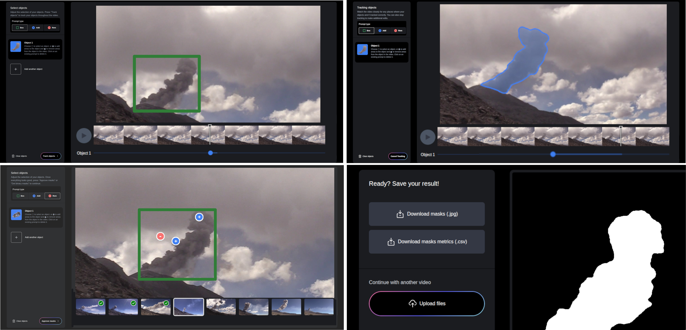

# GuidedSAM-Plume: An expert-guided segmentation framework for volcanic plumes

**Taddeo D’Adamo1, Simon Thivet2, Catherine Pothier1, Riccardo Simionato2,3,
Allan Fries2, Jonathan Lemus2,3, Costanza Bonadonna2, Laure Tougne Rodet1,
and Bertrand Kerautret1**

1 Université Lumière Lyon 2, INSA Lyon, CNRS, Universite Claude Bernard Lyon 1,
Ecole Centrale de Lyon, LIRIS, UMR5205, 69029 Bron, France  
2 Department of Earth Sciences, University of Geneva, Geneva, Switzerland  
3 Department of Computer Sciences, University of Geneva, Carouge, Switzerland

## About

Welcome to the GuidedSAM-Plume repository!

**GuidedSAM-Plume** is an open-source interactive segmentation framework for delineating volcanic plumes in both still images and video sequences. It leverages the zero-shot capabilities of SAM2 <a href="#fn1">[1]</a> to generate segmentation masks from minimal user inputs in the form of point prompts or bounding boxes. The semi-automatic workflow reduces manual annotation effort while preserving expert control and iterative refinement.

On a workstation equipped with an NVIDIA GeForce RTX 4080 (16 GB VRAM), annotation time was reduced **from approximately 2 hours to 5–10 minutes** for 10-frame sequences compared with conventional manual annotation workflows.

Segmentation performance was assessed using standard segmentation metrics, complemented by evaluation based on morphological descriptors commonly used in volcanological studies, including aspect ratio, convexity, and solidity. These additional measures provided a more comprehensive assessment of potential induced biases affecting downstream scientific analyses. The evaluation protocol is detailed in the paper

Beyond efficiency gains, the use of a unified semi-automatic framework also contributes to reduced intra-annotator variability, improving consistency across generated annotations.

Although developed for volcanological use cases, the framework is applicable to other environmental monitoring applications facing similar challenges.

## Functionality
The framework supports interactive segmentation of both single images and temporal sequences. Users initialize segmentation using either a positive **point** prompt or a **bounding box**, and iteratively refine the results through additional prompts (**positive** and **negative points**).

For video data, the system **propagates masks across frames** to maintain temporal consistency while allowing correction at key frames. The interface includes tools for mask visualization, adjustment, and export for downstream analysis. 

It also supports the **extraction of morphometric parameters** from segmented objects. The computed parameters are: *aspect ratio, perimeter, area, perimeter of the convex hull, area of the convex hull, max and min Feret diameters*.

## Installation

See the [INSTALL.md](INSTALL.md) file for installation instructions.

## Usage

See the [GUI user guide](GUI_user_guide.pdf) for instructions on how to use the app.

## Dataset

The dataset used in the paper to validate the framework is made available and can be accessed [here](https://datasets.liris.cnrs.fr/guidedsam-plume-dataset-version1).

It comprises 47 annotated time-series sequences, totaling 759 frames, collected using ground-based camera systems during field campaigns and during the monitoring of explosive volcanic eruptions. The sequences have a mean length of 16 frames and an average spatial resolution of 2996 × 1685 pixels.

The dataset covers a broad range of acquisition and environmental conditions, including varying viewing angles, illumination, occlusions, and weather, as well as diverse plume dynamics from early formation to fully developed structures.

Two annotation sources are provided, both produced by expert volcanologists: manual segmentations and segmentation masks generated using the GuidedSAM-Plume interactive annotation framework.

## License

See the [LICENSE](LICENSE) and [NOTICE](NOTICE) files for details.

## References

[1] Ravi, N., Gabeur, V., Hu, Y. T., Hu, R., Ryali, C., Ma, T., ... & Feichtenhofer, C. (2025, May). Sam 2: Segment anything in images and videos. In International Conference on Learning Representations (Vol. 2025, pp. 28085-28128).

